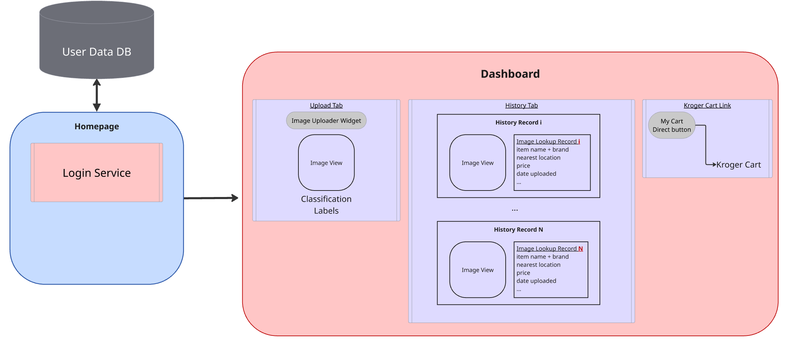
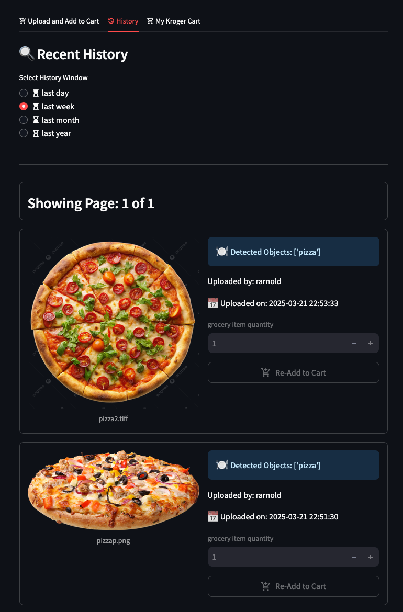
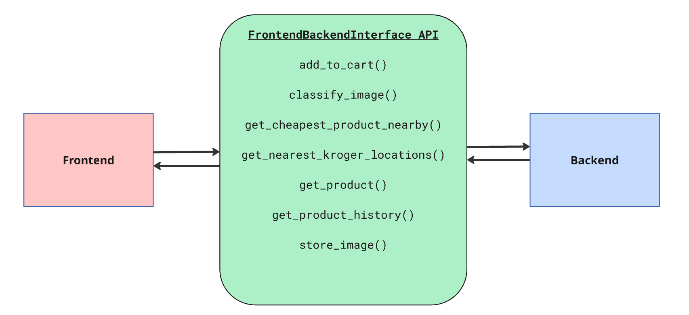
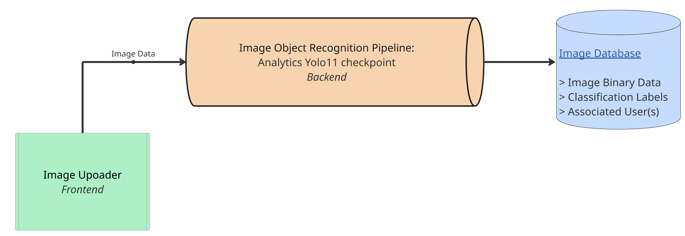
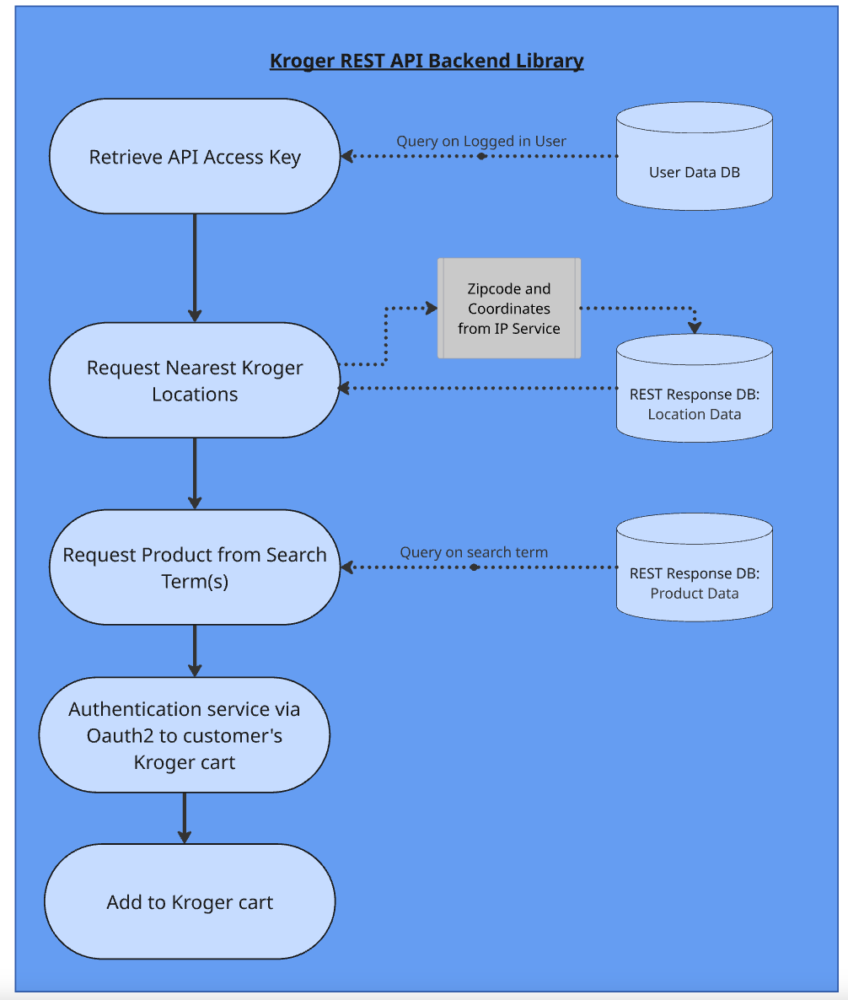
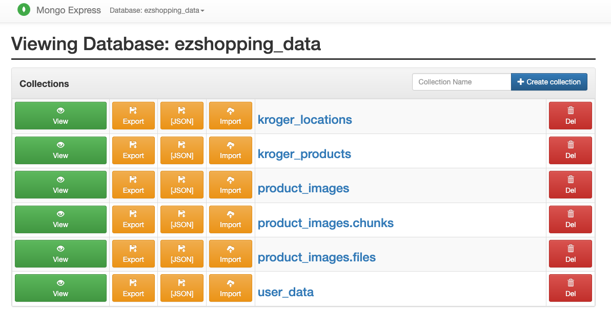
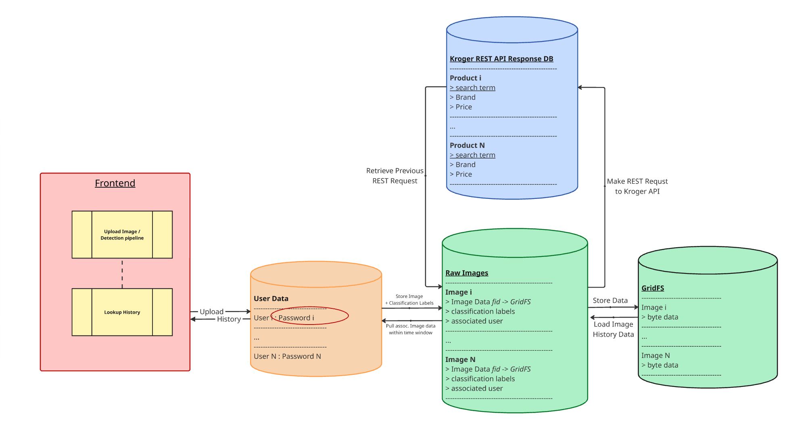

# Design and Architecture for EzShopping

**High Level Architecture**


At a high-level, our app contains the following services:

- Frontend
- Backend
- Frontend-Backend-Interface
- Databases

Each service will be describe in more detail in the sections that follow. The component that we want to emphasize is the *FrontendBackendInterface*. We designed so that high-level tasks could be abstracted from the perspectives of the frontend and backend. For example, The frontend may request to add an item to the user's cart. We designed the interface so that the frontend service only needs to call one function from the interface for this task.  The backend implementations, such as: authentication, interacting with REST endpoints, and interacting with databases, are abstracted by the backend library modules.

## Frontend Design

---



For our frontend driver service, we used the [Streamlit library](https://docs.streamlit.io/).  Our frontend application hosts two pages:
1. Homepage / Login
2. Dashboard

### Login
Our login service uses text field widgets that enable the user to enter usernames and password. Thanks to a built-in streamlit feature, the password is hidden as the user types it. If the username entered was not found, the application prompts the user to create an account. Specifically, the code will query a user database to see if the user exists. Once a new account is created, we encode the password using python library: [`hashlib`](https://docs.python.org/3/library/hashlib.html).

```py
hashlib.sha256(str(st.session_state.new_password).encode()).hexdigest()
```

Upon login, the user is asked to authenticate their Kroger account. A button is shown that takes the user to the Kroger sign-in page. After a successful sign-in, the Kroger site redirects back to the app via a gateway. We use the free version of [ngrok as our gateway](https://ngrok.com/docs/), to redirect traffic back to our app. After authentication, Kroger appends an access key the the URL as a response, which we ingest and use for the "Add to cart" API calls. Kroger uses [Oauth2 authentication](https://developer.kroger.com/documentation/public/security/guides-oauth?beta=true) for this whole proccess. Once authenticated, the user is redirected to the main Dashboard page. We have also implemented a "log out" button, which redirects the user back to the home/login page.

### Dashboard

The dashboard page is where most of the business logic exists. Here, there are three tabs that serve as sub-pages:
1. Upload
2. History
3. Kroger cart

#### Upload
The upload tab allows the user to upload an image, and supports the following image formats: *.png, *.jpg, *.tiff. Upon upload, the frontend service will pass the image data to a [`FrontendBackendInterface`](https://github.com/rarnold97/ceg6110-term-project-group-2/blob/main/ez_shopping/frontend_backend_interface.py) client. The client calls modules from the backend to invoke the image recognition pipeline, which currently uses a pretrained [Ultralytics Yolo11](https://docs.ultralytics.com/models/yolo11/) model checkpoint. After the model processes, it stores its results to a database (which links classification labels to image file pointers) and displays a message to the user what it classifies the objects in the image the image as.

After classification, two widgets are enabled for the user to interact with for adding grocery items to their Kroger cart instance. The first is an uptick widget, which allows the user to set the quantity of items to add; the scond is a button that will attempt to add the item list to their Kroger cart. The implementation of this is integrated together by the [`FrontendBackendInterface`](https://github.com/rarnold97/ceg6110-term-project-group-2/blob/main/ez_shopping/frontend_backend_interface.py).

### History
The second tab allows the user to see a history of their image uploads, and data for the products contained in the images. Data Includes:

- Detected Label(s)
- brand
- price
- nearest location
- date uploaded
- etc.

The frontend has logic to ensure that the history is only displayed for the logged in user. The user is also presented a radio menu that lets them filter the time window. They are offered: the past day, past week, past month, and past year. We also set a limit on the number of items that can be rendered (default is 5). Any items in surplus of the limit are displayed on a "next page", and the user is given buttons to advance or decrement the page, as well as what the current page is. The purpose of this was to reduce the amount of widgets spawned at any given pass of the frontend application loop.

Once a record is rendered, the user can "re-add" the item to their cart. A quantity ticker is available to allow the user to customize the quantity of items to "re-add" to their cart instance.



## Frontend Backend Interface API

---



We designed an API that we call: `FrontendBackendInterface`, to glue the frontend to the backend together in a streamlined, integratable fashion.  This interface allows developers to make progress, either on the fronted or backend, without worrying about all the implementation details of the backend/frontend. This design was effective for making progress on this application. Each method is designed to accomplish a general task that a user will require during a session.  In general, each function pulls functions from different backend modules together and the necessary code to interact with our project databases. Since the implementation details are abstracted in each method, it simplifies usage, such that a developer only needs to make either a single or couple of method calls. The full implementation details may be found within our source code [`FrontendBackendInterface.py`](https://github.com/rarnold97/ceg6110-term-project-group-2/blob/main/ez_shopping/frontend_backend_interface.py) on Github.

## Classification Model Design and Reasoning

---



Our survey of image recognition models was limited, due to time constraints. We primarly compared and contrasted three models: the Ultralytics Yolo11 model, Google TensorFlow Hub, and Facebook Detectron2. We ultimately decided to use the Ultralytics Yolo11 model. The primary factor that influenced our decision was the ease-of-use of the Yolo model. It required minimal code to integrate, is fast, and performs reasonably well. However, the fidelity of this model was limited. Moreover, it was only able to provide detection on a limited subset of grocery items. Therefore, future research would involve surveying higher-fidelity models for object detection.

In terms of implementation, the workflow was simple. First, we marshalled image data from the frontend image uploader widget into a [PIL Image](https://pillow.readthedocs.io/en/stable/reference/Image.html) datastructure. If a checkpoint had not already been loaded, we load a Yolo11 checkpoint for the pre-trained machine learning model. Then, we pass the image data through the model pipeline, and collect the predicted labels. Finally, we intersect the label with a pre-selected set of labels that would be acceptable grocery store items. For example, if the detection model can classify a cat from an image, we don't want to accept that because you probably cannot purchase a cat at a Kroger grocery store chain. If the detected label is not acceptable, we instead return and empty list in the code. For more implementation details, see our [source code: `image_classification.py`](https://github.com/rarnold97/ceg6110-term-project-group-2/blob/main/ez_shopping/backend/image_classification.py) on Github.

## Backend Kroger REST API Library and Workflow

---



The diagram above outlines the workflow of the backend library we designed to interact with Kroger API REST endpoints. There are two primary points of interaction with the frontend: when the user authenticates via oauth2 to provide programatic access to their cart, and when the user elects to add item(s), from an uploaded image file, to their cart. All interaction witht the frontend gets abstracted by the `FrontendBackendInterface`. Below is an example walking through a scenario:

!!! example "Example Backend Kroger API Interaction"
    Suppose the user has uploaded an image, the detection labels have been generated, and they are ready to add 2 apples to their shooping cart, the following will likely occur:

    1. **Retrieve a client API token** to interact with Kroger's endpoints.
    2. **Request the nearest location**, based on the active IP of the currently running application client. If this location is already available in our Kroger Locations Database, we query it for faster access. Otherwise, we make a REST request to the Kroger "Locations" API.
    3. **Request product data.** All image classification labels are used as product search terms as is. If the product we are looking for has already been stored in our Kroger Products databse, query it instead for faster access. Otherwise, we make a REST request to the Kroger "Products" API, with appropriate product filters (namely lowest price).
    4. **Collect a proper authenticated Oauth2 token.** This is associated per-user. We also store this per-session in our User Database. If we cannot query it from our database,
    we ingetst the token from the redirect URL that kroger updates post-authentication on their end. This is possible due to our ngrok gateway service.
    5. **Add the product(s) to the user's kroger cart** using the Kroger "Carts" API. Using data, like requested quantity, we update appropriate url keys.


## Database Design

---


**Mongo Collection Preview**



Using Mongo DB as our database server, we assembled the following collections (a.k.a smaller databases):

- user_data
- product_images (with associated GridFS as image data File Storage service)
- kroger_locations
- kroger_products

The user_data collection stores user credentials. Primarily, the records consist of usernames, passwords (encrypted), and kroger customer tokens. The product_images collection stores metadata about all the product images. This includes: image filename (with extension), file pointer to our File Storage server, and associated classification labels from the object detection pipeline. Storing classification labels with the uploaded image reduces the number of calls we must make to our image detection pipeline, which tends to add computational overhead. Next, we have databases associated with Kroger API request data: kroger_locations and kroger_products. Product records and their price data are linked to the kroger_locations collection, to associate their data with the store location we gathered from. Each product record primarily contains information about the item, as it pertains to Kroger. For insance, they contain price information, universal product codes, brand names, which location the data is from, inventory, search term, and more.

### Database Linkage

**Architecture Diagram**



In order for user requests to flow smoothly and reduce overhead, we had to be strategic about how to link the database collections together.

!!! note
    Future work may include improving our databse schema and linkage design.

We first always take into account who the active user is, and load their tokens into memory from the User Database. Let us start from left-to-right in the database diagram above. When an image is uploaded, it first goes through our object detection pipeline. After classification labels have been generated for all the detected objects, the data is compiled together to form a Product Record. We also associate the active user via username with the image, as well as the timestamp of upload. Then, the image metadata and classification labels are stored in our Product Iamge Database (shown by left-most green in the diagram). Once the metadata is stored, we also create a file pointer to our File Storage service (shown by the right-most green block). At this point, the code queries the Kroger REST API Response databases, namely the Products Database, to see if data for the classified objects are already available. The most important query key is the search term of the item. If no data exists, then we have to make requests to the Kroger API. The first is the Locations API. We determine what the nearest Kroger location is, based on the client's IP address. Then, we make a search at the selected, nearest location for each object detected in the uploaded image(s). Once we get responses, we store all the location data to a collection, and then all the product data to a separate collection. Each product record contains a location ID to link the two collections together.

As a case-study, we are going to walk through all the database interactions that occur when populating the history tab of our dashboard page. Furthermore, this example is appropriate, because this feature of our application requires the most interaction with our databases. Suppose the user clicks on the history tab, and they select the "1 week" radio menu option. We first determine how much time has elapsed in one week in `datetime.datetime` format. Then, we filter the Products collection for all products that have been uploaded by the active user in the past week time window.  Once we gather these products, we then iterate through them all to obtain fid pointers to the actual uploaded image data. Using the file pointer, we can load all image data into memory. Then, we collect all store data about that product, including: nearest location, price, item brand name, date uplaoded, etc. Once all data is collected, we render separate tiles for each image that display all the aforementioned data with a rendering of the past uploaded image.

### Sample Database Record Schema Classes and Database Entries

Below, we include all the different Python class schemas and sample collection entires for all involved Mongo database collections.

!!! abstract "Base Database Record Class"
    **Base DB Record Python Class**
    ```py
    @dataclass
    class DataBaseRecord:
        """Base class for records that can be stored in the database

        The fields are optional so that a user can still construct the record,
        without populating the fields that the database will be populating automatically.
        """

        uid: Optional[ObjectId] = None
        latest_update_time: Optional[datetime.datetime] = None
    ```


!!! example "User Data"
    **User Data Python Class Schema**
    ```py
    @dataclass
    class UserData(DataBaseRecord):
        username: str = ""
        password: str = ""
        access_code: str = ""
        kroger_access_token: str = ""
        kroger_refresh_token: str = ""
    ```

    **User Data DB Record**
    ```json
    {
        _id: ObjectId('67d399971356f8c19c17054e'),
        uid: null,
        latest_update_time: ISODate('2025-03-13T22:51:03.244Z'),
        username: 'megamanx',
        password: 'a2b26668dd97c2f93ab0c9f877ff5a4ef7f3e0f3755d12880bedd1bdfd497ff3',  // ascii representation: rockman
        access_code: 'XXXX',
        kroger_access_token: 'YYYYY',
        kroger_refresh_token: 'ZZZZZZZZZ'
    }
    ```

!!! example "Product Image Data"

    **Product Image Python Class Schema**
    ```py
    @dataclass
    class ProductImageRecord(DataBaseRecord):
        file_storage_id: ObjectId | None = None
        image_filename: str | None = None
        image_size: Tuple = None
        image_mode: str = None
        classification_labels: str | None = None
        username: str | None = None
        linked_product_ids: List[str] = field(default_factory=list)
    ```

    **Product Image DB Record**
    ```json
    {
        _id: ObjectId('67cf94ca5006d85ff30c5400'),
        uid: null,
        latest_update_time: ISODate('2025-03-10T21:41:30.168Z'),
        file_storage_id: ObjectId('67cf94c95006d85ff30c5372'),
        image_filename: 'real_photo_1.png',
        image_size: [
            3024,
            4032
        ],
        image_mode: 'RGB',
        classification_labels: [
            'orange',
            'banana'
        ],
        username: 'rarnold97',
        linked_product_ids: [
            ObjectId('67d21b975c9d0750485791e9'),
            ObjectId('67d21b9e5c9d0750485791f4')
        ]
    }
    ```

!!! example "Product Data"
    **Product Data Python Class Schema***
    ```py
    @dataclass
    class ProductCard(DataBaseRecord):
        """
        Refined results from Kroger Product API responses.
        """

        search_term: str = ""
        product_id: str = ""
        nearest_location_id: str = ""
        product_uri: str = ""
        brand: str = ""
        product_descriptor: str = ""
        price_usd: float = None
        aisle: List[Dict] = ""
        inventory_level: Inventory | int = None

    ```

    **Product DB Record**
    ```json
    {
        _id: ObjectId('67d39b52595c19e220f430a1'),
        uid: null,
        latest_update_time: ISODate('2025-03-13T22:58:26.370Z'),
        search_term: 'apple',
        product_id: '0000000004130',
        nearest_location_id: '01400938',
        product_uri: '/p/large-fuji-apple-each/0000000004131?cid=dis.api.tpi_products-api_20240521_b:all_c:p_t:ezshopping-243261243',
        brand: 'Fresh Apples',
        product_descriptor: 'Large Fuji Apple – Each',
        price_usd: 0.99,
        aisle: [
            '{"description": "PRODUCE", "number": "0"}'
        ],
        inventory_level: 1
    }
    ```

!!! example "Location Data"
    **Kroger Location Python Class Schema**
    ```py
    @dataclass
    class KrogerLocationCard(DataBaseRecord):
        """
        Filtered subset of response data from kroger locations request.
        """

        store_id: int = None
        zip_code: str = ""
        store_name: str = ""
        store_address: Dict = ""
        distance_mi: float = None
        departments: List[Dict] = field(default_factory=list)

        # sort on distance
        def __lt__(self, other: KrogerLocationCard):
            return self.distance_mi < other.distance_mi

        def __le__(self, other: KrogerLocationCard):
            return self.distance_mi <= other.distance_mi

        def __gt__(self, other: KrogerLocationCard):
            return self.distance_mi > other.distance_mi

        def __ge__(self, other: KrogerLocationCard):
            return self.distance_mi >= other.distance_mi
    ```

    **Kroger Location Record**
    ```json
    {
        _id: ObjectId('67a8fca3ebd56f3e259e70c2'),
        uid: null,
        latest_update_time: ISODate('2025-02-09T19:06:11.306Z'),
        store_id: '01400747',
        zip_code: '45377',
        store_name: 'Kroger - Vandalia',
        store_address: '{"addressLine1": "780 Northwoods Blvd", "city": "Vandalia", "state": "OH", "zipCode": "45377", "county": "MONTGOMERY COUNTY"}',
        distance_mi: 0.9846650874390342,
        departments: [
            '{"departmentId": "73", "name": "Eco Atm"}',
            '{"departmentId": "TL", "name": "Tobacco"}',
            '{"departmentId": "0J", "name": "Home Chef"}',
            '{"departmentId": "18", "name": "Books And Magazines"}',
            '{"departmentId": "26", "name": "Kosher Food"}',
            '{"departmentId": "31", "name": "Coinstar"}',
            '{"departmentId": "55", "name": "Atm"}',
            '{"departmentId": "61", "name": "Ticketmaster"}',
            '{"departmentId": "MO", "name": "Money Orders"}',
            '{"departmentId": "46", "name": "Sushi"}',
            '{"departmentId": "13", "name": "Cell Phone"}',
            '{"departmentId": "16", "name": "Drive-thru Pharmacy"}',
            '{"departmentId": "20", "name": "One Hour Photo"}',
            '{"departmentId": "21", "name": "Self Checkout"}',
            '{"departmentId": "29", "name": "Event Tickets"}',
            '{"departmentId": "45", "name": "Wine"}',
            '{"departmentId": "22", "name": "Post Office"}',
            '{"departmentId": "48", "name": "Starbucks"}',
            '{"departmentId": "65", "name": "Money Services"}',
            '{"departmentId": "08", "name": "Floral"}',
            '{"departmentId": "09", "name": "Pharmacy", "phone": "9372642420", "hours": {"open24": false, "monday": {"open": "08:00", "close": "20:00", "open24": false}, "tuesday": {"open": "08:00", "close": "20:00", "open24": false}, "wednesday": {"open": "08:00", "close": "20:00", "open24": false}, "thursday": {"open": "08:00", "close": "20:00", "open24": false}, "friday": {"open": "08:00", "close": "20:00", "open24": false}, "saturday": {"open": "09:00", "close": "18:00", "open24": false}, "sunday": {"open": "10:00", "close": "17:00", "open24": false}}}',
            '{"departmentId": "12", "name": "Cosmetics"}',
            '{"departmentId": "23", "name": "Drug & General Merchandise"}',
            '{"departmentId": "44", "name": "Beer"}',
            '{"departmentId": "63", "name": "I-wireless"}',
            '{"departmentId": "89", "name": "Western Union"}',
            '{"departmentId": "94", "name": "Pickup", "phone": "9376650323"}',
            '{"departmentId": "01", "name": "Deli"}',
            '{"departmentId": "04", "name": "Meat Department"}',
            '{"departmentId": "32", "name": "Natural And Organics"}',
            '{"departmentId": "53", "name": "Boar\'s Head"}',
            '{"departmentId": "56", "name": "The Little Clinic/Walk-in Center"}',
            '{"departmentId": "69", "name": "Online Deli/Bakery Ordering"}',
            '{"departmentId": "95", "name": "Diesel"}',
            '{"departmentId": "LY", "name": "Lottery Tickets"}',
            '{"departmentId": "02", "name": "Bakery"}',
            '{"departmentId": "03", "name": "Cheese Counter"}',
            '{"departmentId": "19", "name": "Videos"}',
            '{"departmentId": "99", "name": "Check Cashing"}',
            '{"departmentId": "AF", "name": "Account Funding"}',
            '{"departmentId": "05", "name": "Seafood Department"}',
            '{"departmentId": "10", "name": "Gas Station", "phone": "9376650310", "hours": {"open24": false, "monday": {"open": "06:00", "close": "22:00", "open24": false}, "tuesday": {"open": "06:00", "close": "22:00", "open24": false}, "wednesday": {"open": "06:00", "close": "22:00", "open24": false}, "thursday": {"open": "06:00", "close": "22:00", "open24": false}, "friday": {"open": "06:00", "close": "22:00", "open24": false}, "saturday": {"open": "06:00", "close": "22:00", "open24": false}, "sunday": {"open": "06:00", "close": "22:00", "open24": false}}, "address": {"addressLine1": "780 Northwoods Blvd", "city": "Vandalia", "state": "OH", "zipCode": "45377"}, "geolocation": {"latitude": 39.8993538, "longitude": -84.1841067, "latLng": "39.8993538,-84.1841067"}, "offsite": true}',
            '{"departmentId": "17", "name": "Bath"}',
            '{"departmentId": "50", "name": "Olive Bar"}',
            '{"departmentId": "60", "name": "Redbox"}'
        ]
    }
    ```