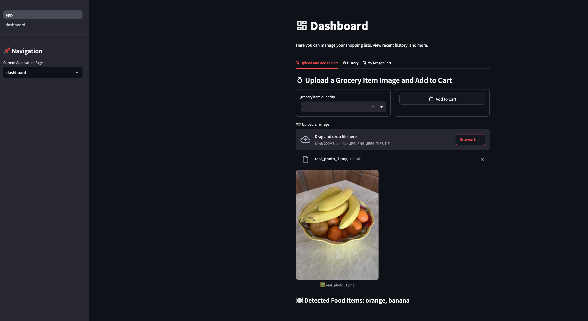

# Welcome to EzShopping Documenation

## Overview

Ez Shopping is an application that enables you to take a picture of a common grocery food item(s), have those item(s) detected by a machine learning algorithm, and subsequently add the items to an authenticated Kroger Cart. The goal is to make grocery shopping, a mundande chore, easier and more convienient. The application does a search on items you are interested in, and filters them down by the lowest price, and the nearest Kroger location to you, based on your current IP address. This application is written primarily in Python, using Streamlit to host the frontend. We also make use of Docker, Python-Poetry, and ngrok.

## Credits
This project was completed under the jurisdiction of Dr. Sean Banerjee at Wright State University, for CEG-6110: "Intro to Software Engineering", a graduate course in the College of Engineering.

| Author | Email |
| --- | --- |
| Ryan Arnold | arnold.227@wright.edu |
| Janki Parmar | parmar.29@wright.edu |
